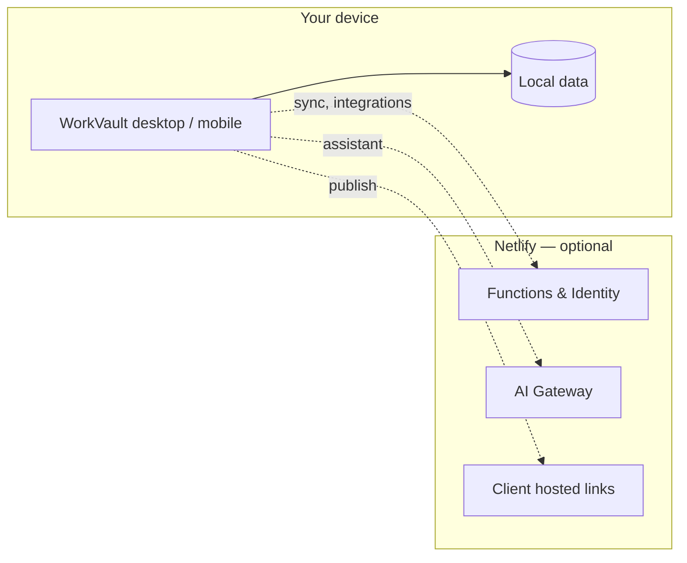

<p align="center">
  
</p>

<h1 align="center">WorkVault</h1>

<p align="center">
  <strong>Local-first platform for contract workers</strong><br />
  Contracts · time tracking · invoices · client workspaces · integrations
</p>

<p align="center">
  <a href="https://github.com/mechaniel-coder/workvault/releases/latest"></a>
  <a href="https://workvault.netlify.app"></a>
</p>

---

## Download the app (recommended)

WorkVault is a **desktop app** for Mac, Windows, and Linux. Your data lives on your machine — not in a browser tab.

| Platform | Download |
|----------|----------|
| **macOS** (Apple Silicon — M1/M2/M3/M4) | [**Download `.dmg`**](https://github.com/mechaniel-coder/workvault/releases/latest) |
| **Windows** (64-bit) | **Coming soon** — `.exe` installer |
| **Linux** (64-bit) | **Coming soon** — `.AppImage` / `.deb` |

### macOS — install in 3 steps

1. **Download** the `.dmg` from [Releases](https://github.com/mechaniel-coder/workvault/releases/latest)
2. **Open** the disk image and drag **WorkVault** into **Applications**
3. **Launch** WorkVault from Applications or Spotlight

> **First launch:** macOS may show an “unidentified developer” warning because the app is not notarized yet.  
> Right-click **WorkVault → Open**, then confirm once.

Data is stored at: `~/Library/Application Support/com.workvault.desktop/`

### Windows — coming soon

Windows `.exe` installer builds are **coming soon**. Until then, use the [web app](https://workvault.netlify.app) or watch [Releases](https://github.com/mechaniel-coder/workvault/releases/latest) for updates.

When available: run the installer from Releases and launch from the Start menu. Data will be stored at `%APPDATA%\com.workvault.desktop\`.

### Linux — coming soon

Linux `.AppImage` and `.deb` packages are **coming soon**. Until then, use the [web app](https://workvault.netlify.app) or watch [Releases](https://github.com/mechaniel-coder/workvault/releases/latest) for updates.

When available: install from Releases and launch from your app menu. Data will be stored at `~/.local/share/com.workvault.desktop/`.

---

## Mobile (PWA)

On a phone or tablet, open [workvault.netlify.app](https://workvault.netlify.app):

- **Android:** tap **Install app** when prompted
- **iOS:** Share → **Add to Home Screen**

The PWA includes bottom navigation and offline shell caching. For App Store / Play Store builds, see [docs/PLATFORMS.md](docs/PLATFORMS.md).

---

## Industry workspaces (v0.2.0)

WorkVault adapts to how you work. Pick your industry during setup or at [workvault.netlify.app/welcome](https://workvault.netlify.app/welcome):

| Industry | What's tailored |
|----------|-----------------|
| **General** | Full feature set — default experience |
| **Creative & Design** | Creative rights, proposals, portfolio records |
| **Software & Tech** | SOWs, IP protection, Cursor CLI, deployments |
| **Construction & Trades** | Change orders, subs, licenses, customers |
| **Consulting & Coaching** | Engagements, session tracking, proposals |
| **Marketing & Agency** | Campaign pipeline, pitch decks, retainers |
| **Legal & Paralegal** | Matters, engagement agreements, billable hours |
| **Healthcare & Wellness** | Sessions, care agreements, credentials |
| **Photo & Video** | Bookings, usage rights, edit time, galleries |
| **Writing & Content** | Assignments, revision log, copyright protection |
| **Real Estate** | Deal pipeline, listing agreements, commissions |
| **Education & Tutoring** | Sessions, learning agreements, enrollments |
| **Accounting & Bookkeeping** | Engagements, 1099, reconciliation, billing |
| **Events & Weddings** | Event pipeline, vendors, deposit billing |
| **Nonprofit & Grants** | Grant pipeline, program records, deliverables |
| **Fitness & Training** | Sessions, packages, progress tracking |
| **Architecture & Design** | Design phases, scope changes, drawing records |
| **Music & Audio** | Session quotes, studio time, rights protection |
| **Culinary & Catering** | Menu proposals, bookings, prep time |
| **Translation** | Project quotes, delivery log, confidentiality |
| **Research & Academia** | Study records, lab hours, grant deliverables |
| **Cleaning Services** | Recurring routes, job time, extra services |
| **Automotive & Repair** | Repair orders, bay time, warranty records |
| **Pet Services** | Visit tracking, care agreements, pet records |
| **Insurance & Adjusting** | Policy pipeline, renewals, compliance docs |
| **Fashion & Apparel** | Custom orders, fittings, design IP |
| **Beauty & Salon** | Appointments, packages, client formulas |
| **Security Services** | Shift logs, guard certs, incident records |
| **Landscaping & Lawn** | Routes, crew hours, seasonal extras |
| **Childcare & Nanny** | Care agreements, daily logs, family billing |
| **Logistics & Delivery** | Dispatch queue, drive time, accessorials |
| **Solar & Energy** | Install pipeline, site hours, change orders |
| **Film & Production** | Bids, deal memos, shoot day logs |
| **Aviation & Flight** | Flight logs, training agreements, certs |
| **Print & Signage** | Job queue, rush fees, production tracking |
| **Property Management** | Unit pipeline, work orders, vendor tracking |

Each industry changes **navigation**, **labels**, **dashboard copy**, **theme colors**, and **welcome pages** with workflows, examples, and FAQ. Change anytime in **Settings → Industry & workspace**.

Browse all **36 workspaces** at [workvault.netlify.app/welcome](https://workvault.netlify.app/welcome) — searchable and grouped by category.

---

## Connect to the cloud (optional)

The desktop app works fully offline. Turn on online features when you need them:

1. Open **WorkVault** → **Settings** → **Cloud Sync**
2. **Create an account** or sign in (Netlify Identity)
3. Set an **encryption passphrase** and enable sync if you want encrypted backup

Online features (via [workvault.netlify.app](https://workvault.netlify.app)):

- Encrypted cloud backup
- AI assistant
- Payment processors, Gmail, QuickBooks/Xero, Google Drive/Dropbox, Slack, and more
- Hosted **client workspace links**

You do **not** need the website for daily work — the desktop app is primary.

---

## Send work to clients

From **Clients** in the app:

| Method | What it does |
|--------|----------------|
| **Send Client WorkVault** | Copies a hosted link, downloads a `.workvault` file, saves locally, syncs to Netlify |
| **Export workspace file only** | Offline handoff — client imports the file on their device |

Clients can also open a shared link at `/client/:token` or import a file at [workvault.netlify.app/open-client](https://workvault.netlify.app/open-client).

---

## Self-host (optional)

Run WorkVault on your own server with Docker:

```bash
cd deploy
docker compose up -d --build
```

See [docs/PLATFORMS.md](docs/PLATFORMS.md) for API proxy options and full platform details.

---

## Architecture



---

## For developers

Source access is governed by [LICENSE](LICENSE). To request permission to clone or modify the codebase, [submit a license inquiry](https://github.com/mechaniel-coder/workvault/issues/new?template=license_inquiry.yml).

### Prerequisites

- Node.js 20+
- Rust ([rustup](https://rustup.rs)) — desktop builds
- Xcode / Android Studio — Capacitor store builds

### Web

```bash
npm install
npm run dev          # local dev
npm run build        # production build (includes PWA)
```

Production web deploy: [workvault.netlify.app](https://workvault.netlify.app)

### Desktop

```bash
npm install
npm run tauri:dev    # hot-reload desktop app
npm run installer    # build installer for your OS (.dmg / .exe / AppImage / .deb)
```

### Mobile (Capacitor)

```bash
npm run build:mobile
npx cap add ios && npx cap add android   # first time only
npm run cap:sync
npm run cap:ios      # or cap:android
```

### Releases

Official installers are published on [GitHub Releases](https://github.com/mechaniel-coder/workvault/releases). Tag pushes can trigger the release workflow when Actions is available.

---

## Project layout

| Path | Purpose |
|------|---------|
| `src/` | React app (contractor UI, client shells, settings) |
| `src-tauri/` | Desktop wrapper (Tauri — Mac/Win/Linux) |
| `capacitor.config.ts` | iOS/Android native shell config |
| `deploy/` | Docker self-host stack |
| `docs/PLATFORMS.md` | Full multi-platform guide |
| `netlify/functions/` | Serverless API (payments, OAuth, AI, sync) |
| `netlify.toml` | Netlify build & SPA routing |

---

## License

**Copyright © 2026 mechaniel-coder. All rights reserved.**

This repository is public for transparency and distribution of official
release builds only. **The source code is not open source.**

| Allowed without a license | Requires a written license |
|---------------------------|----------------------------|
| Download and use official [Releases](https://github.com/mechaniel-coder/workvault/releases) (desktop installers) | Cloning, forking, or copying this repository |
| Use the hosted web app at [workvault.netlify.app](https://workvault.netlify.app) | Modifying the source or creating derivative works |
| | Redistributing, reselling, or white-labeling the codebase |

**No cloning, forking, or reuse of the source code without obtaining a license
from the copyright holder.**

Full terms: [LICENSE](LICENSE)

**License inquiries:** [Request a license](https://github.com/mechaniel-coder/workvault/issues/new?template=license_inquiry.yml)
