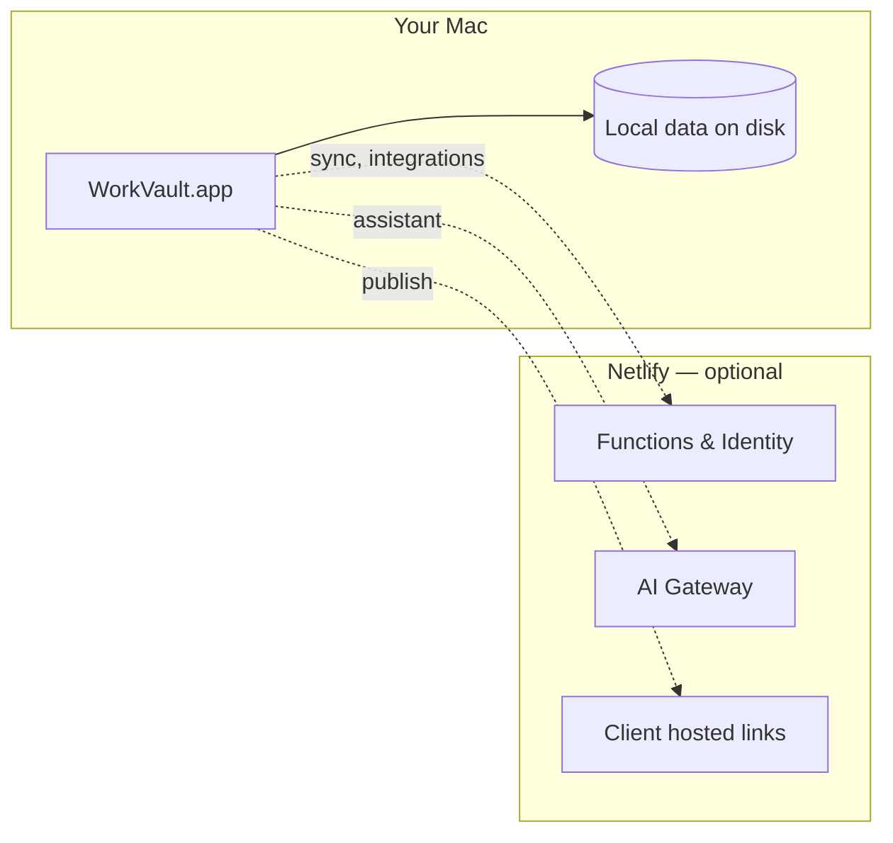

<p align="center">
  
</p>

<h1 align="center">WorkVault</h1>

<p align="center">
  <strong>Local-first platform for contract workers</strong><br />
  Contracts · time tracking · invoices · client workspaces · integrations
</p>

<p align="center">
  <a href="https://github.com/mechaniel-coder/workvault/releases/latest"></a>
  <a href="https://github.com/mechaniel-coder/workvault/actions/workflows/ci.yml"></a>
  <a href="https://workvault.netlify.app"></a>
</p>

---

## Download the app (recommended)

WorkVault is a **Mac desktop app**. Your data lives on your machine — not in a browser tab.

| Platform | Download |
|----------|----------|
| **macOS** (Apple Silicon — M1/M2/M3/M4) | [**Download latest `.dmg`**](https://github.com/mechaniel-coder/workvault/releases/latest) |

### Install in 3 steps

1. **Download** the `.dmg` from [Releases](https://github.com/mechaniel-coder/workvault/releases/latest)
2. **Open** the disk image and drag **WorkVault** into **Applications**
3. **Launch** WorkVault from Applications or Spotlight

> **First launch:** macOS may show an “unidentified developer” warning because the app is not notarized yet.  
> Right-click **WorkVault → Open**, then confirm once.

Your data is stored at:

`~/Library/Application Support/com.workvault.desktop/workvault-state.json`

---

## Connect to the cloud (optional)

The desktop app works fully offline. Turn on online features when you need them:

1. Open **WorkVault** → **Settings** → **Cloud Sync**
2. **Create an account** or sign in (Netlify Identity)
3. Set an **encryption passphrase** and enable sync if you want encrypted backup

Online features (via [workvault.netlify.app](https://workvault.netlify.app)):

- Encrypted cloud backup
- AI assistant
- Payment processors, Gmail, QuickBooks/Xero, Google Drive/Dropbox, Slack, and more
- Hosted **client workspace links**

You do **not** need the website for daily work — the Mac app is primary.

---

## Send work to clients

From **Clients** in the app:

| Method | What it does |
|--------|----------------|
| **Send Client WorkVault** | Copies a hosted link, downloads a `.workvault` file, saves locally, syncs to Netlify |
| **Export workspace file only** | Offline handoff — client imports the file on their device |

Clients can also open a shared link at `/client/:token` or import a file at [workvault.netlify.app/open-client](https://workvault.netlify.app/open-client).

---

## Architecture



---

## For developers

### Prerequisites

- Node.js 20+
- Rust ([rustup](https://rustup.rs)) — for desktop builds only

### Web (Netlify)

```bash
git clone https://github.com/mechaniel-coder/workvault.git
cd workvault
npm install
npm run dev          # local dev
npm run build        # production build
```

Deploys automatically from `main` to [workvault.netlify.app](https://workvault.netlify.app) when connected in Netlify.

### Desktop app

```bash
npm install
npm run tauri:dev    # hot-reload desktop app
npm run installer    # build .dmg in src-tauri/target/release/bundle/dmg/
```

### Cut a release

Releases are built automatically when you push a version tag:

```bash
git tag v0.1.0
git push origin v0.1.0
```

GitHub Actions builds the Mac `.dmg` and attaches it to the release.

---

## Project layout

| Path | Purpose |
|------|---------|
| `src/` | React app (contractor UI, client shells, settings) |
| `src-tauri/` | Mac desktop wrapper (Tauri) |
| `netlify/functions/` | Serverless API (payments, OAuth, AI, sync) |
| `netlify.toml` | Netlify build & SPA routing |

---

## License

Private repository — all rights reserved unless otherwise noted.
